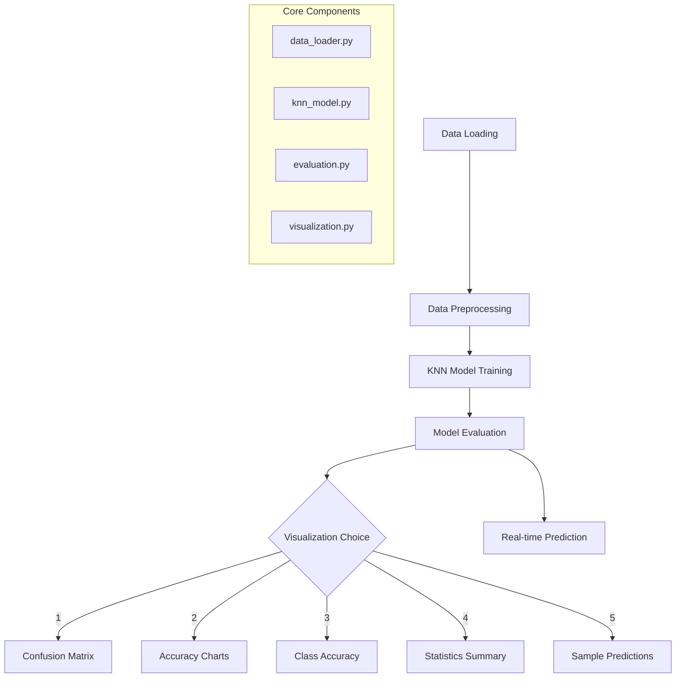

# ASL Character Recognition Project

A comprehensive Computer Vision project for recognizing American Sign Language (ASL) characters using K-Nearest Neighbors (KNN) algorithm with real-time prediction capabilities.

## 📁 Project Structure

```
ComputerVision_ExaminarProject/
├── main.py                    # Main entry point
├── data_loader.py            # Data loading and preprocessing
├── knn_model.py              # KNN implementation
├── visualization.py          # Image visualization utilities
├── evaluation.py             # Model evaluation functions
├── detailed_evaluation.py    # Detailed analysis and reports
├── real_time_prediction.py   # Webcam real-time prediction
├── data/                     # Dataset folder
│   ├── sign_mnist_train.csv
│   └── sign_mnist_test.csv
├── prediction_results/       # Output folder for results
├── requirements.txt          # Python dependencies
└── README.md                # This file
```

## 🎯 System Overview



## 📚 File Details and Functions

### 1. `main.py` - Main Program Controller
**Related Knowledge**: Program Architecture, User Interface Design

| Function | Description | Knowledge Domain |
|----------|-------------|------------------|
| `main()` | Main program execution flow | Software Architecture |
| `show_confusion_matrix()` | Display confusion matrix visualization | Machine Learning Evaluation |
| `show_accuracy_charts()` | Display accuracy vs training size charts | Performance Analysis |
| `show_class_accuracy()` | Display per-class accuracy analysis | Classification Metrics |
| `show_statistics_summary()` | Display comprehensive statistics | Data Analysis |
| `show_sample_predictions()` | Display sample prediction results | Result Visualization |
| `safe_visualization_display()` | Handle matplotlib backend setup | GUI Programming |
| `menu_driven_main()` | Menu-based program execution | User Interface Design |

### 2. `data_loader.py` - Data Management
**Related Knowledge**: Data Science, Computer Vision Preprocessing

| Function | Description | Knowledge Domain |
|----------|-------------|------------------|
| `load_data()` | Load CSV data into numpy arrays | Data Engineering |
| `preprocess_data()` | Normalize and reshape image data | Computer Vision |
| `visualize_samples()` | Display sample images from dataset | Data Visualization |

### 3. `knn_model.py` - Machine Learning Core
**Related Knowledge**: Machine Learning, Pattern Recognition

| Function | Description | Knowledge Domain |
|----------|-------------|------------------|
| `KNN.__init__()` | Initialize KNN classifier | Machine Learning |
| `KNN.fit()` | Train the model with data | Supervised Learning |
| `KNN.predict()` | Make predictions on new data | Classification |
| `KNN._euclidean_distance()` | Calculate distance between points | Mathematical Computing |

### 4. `visualization.py` - Image Output
**Related Knowledge**: Computer Vision, Image Processing

| Function | Description | Knowledge Domain |
|----------|-------------|------------------|
| `save_prediction_images()` | Save prediction results as images | Image Processing |
| `create_result_grid()` | Create grid layout for results | GUI Design |

### 5. `evaluation.py` - Performance Analysis
**Related Knowledge**: Machine Learning Evaluation, Statistics

| Function | Description | Knowledge Domain |
|----------|-------------|------------------|
| `test_with_fixed_dataset()` | Evaluate model on fixed test set | Model Evaluation |
| `test_with_different_train_sizes()` | Analyze performance vs training size | Learning Curves |
| `calculate_metrics()` | Compute precision, recall, F1-score | Classification Metrics |

### 6. `detailed_evaluation.py` - Advanced Analytics
**Related Knowledge**: Statistical Analysis, Machine Learning Metrics

| Function | Description | Knowledge Domain |
|----------|-------------|------------------|
| `plot_confusion_matrix()` | Generate detailed confusion matrix | Classification Analysis |
| `detailed_classification_report()` | Generate comprehensive report | Performance Metrics |
| `calculate_class_metrics()` | Per-class performance analysis | Statistical Analysis |

### 7. `real_time_prediction.py` - Live Recognition
**Related Knowledge**: Computer Vision, Real-time Systems

| Function | Description | Knowledge Domain |
|----------|-------------|------------------|
| `real_time_hand_sign_detection()` | Live webcam ASL recognition | Computer Vision |
| `preprocess_frame()` | Process webcam frame for prediction | Image Processing |
| `draw_prediction_overlay()` | Add prediction text to video | GUI Programming |

## 🔧 Installation and Setup

### Prerequisites
- Python 3.8 or higher
- Webcam (for real-time prediction)
- Dataset files in `data/` folder

### Step 1: Install Dependencies
```bash
pip install -r requirements.txt
```

### Step 2: Verify Dataset
Ensure you have these files in the `data/` folder:
- `sign_mnist_train.csv`
- `sign_mnist_test.csv`

### Step 3: Run the Program
```bash
python main.py
```

## 🚀 Usage Guide

### Running Modes

#### Full Mode (Recommended)
```bash
python main.py
# Choose 'f' for full mode
```

#### Menu Mode
```bash
python main.py
# Choose 'm' for menu mode
# Then select from:
# 1. Run all features
# 2. Training and basic testing only
# 3. Real-time prediction only
# 4. Charts and confusion matrix only
```

### Visualization Options

When running the program, you can choose multiple visualizations:

- **Single choice**: Enter `1` for Confusion Matrix
- **Multiple choices**: Enter `1 2 3` or `1,2,3` for multiple visualizations
- **All visualizations**: Enter `6` or `all`
- **Skip visualizations**: Enter `0` or `skip`

### Available Visualizations

1. **Confusion Matrix** - Shows classification accuracy between classes
2. **Accuracy Charts** - Line and bar charts showing accuracy vs training size
3. **Class Accuracy** - Per-class performance analysis
4. **Statistics Summary** - Comprehensive performance overview
5. **Sample Predictions** - Visual examples of correct/incorrect predictions

## 🧠 Knowledge Domains Covered

### Machine Learning Concepts
- **K-Nearest Neighbors (KNN)**: Lazy learning algorithm
- **Supervised Learning**: Classification with labeled data
- **Cross-validation**: Model evaluation techniques
- **Performance Metrics**: Accuracy, Precision, Recall, F1-score

### Computer Vision Techniques
- **Image Preprocessing**: Normalization, reshaping
- **Feature Extraction**: Pixel-based features
- **Real-time Processing**: Webcam integration
- **Image Classification**: ASL character recognition

### Data Science Methods
- **Data Loading**: CSV parsing, numpy arrays
- **Data Visualization**: Matplotlib, seaborn
- **Statistical Analysis**: Performance metrics
- **Exploratory Data Analysis**: Sample visualization

### Software Engineering Practices
- **Modular Design**: Separated concerns across files
- **Error Handling**: Try-catch blocks
- **User Interface**: Menu-driven interaction
- **Code Documentation**: Comprehensive comments

## 📊 Performance Expectations

- **Training Time**: ~30 seconds for full dataset (27,455 samples)
- **Prediction Speed**: ~0.1 seconds per sample
- **Expected Accuracy**: 85-95% on test set
- **Real-time FPS**: 15-30 FPS depending on hardware

## 🔍 Troubleshooting

### Common Issues

1. **Matplotlib Backend Error**
   ```bash
   # Try different backend
   export MPLBACKEND=TkAgg
   ```

2. **OpenCV Camera Issues**
   ```bash
   # Check camera permissions
   # Try different camera index in real_time_prediction.py
   ```

3. **Memory Issues**
   ```python
   # Reduce sample sizes in show_accuracy_charts()
   # Use smaller test sample in main()
   ```

### Dataset Requirements

- **Training**: 27,455 samples, 28x28 pixels
- **Testing**: 7,172 samples, 28x28 pixels
- **Classes**: 24 letters (excluding J and Z)
- **Format**: CSV with pixel values and labels

## 🎓 Educational Value

This project demonstrates:
- **Machine Learning Pipeline**: From data loading to evaluation
- **Computer Vision Application**: Real-world image classification
- **Software Architecture**: Modular, maintainable code
- **Data Visualization**: Multiple chart types and analysis
- **Real-time Systems**: Live prediction capabilities

## 📈 Future Enhancements

- Deep Learning models (CNN)
- Data augmentation techniques
- Model comparison framework
- Web-based interface
- Mobile app integration

## 🤝 Contributing

1. Fork the repository
2. Create feature branch
3. Commit changes
4. Push to branch
5. Create Pull Request

## 📄 License

This project is for educational purposes. Dataset credit to Sign Language MNIST.

---

**Author**: Computer Vision Project  
**Date**: 2024  
**Course**: Computer Vision and Pattern Recognition